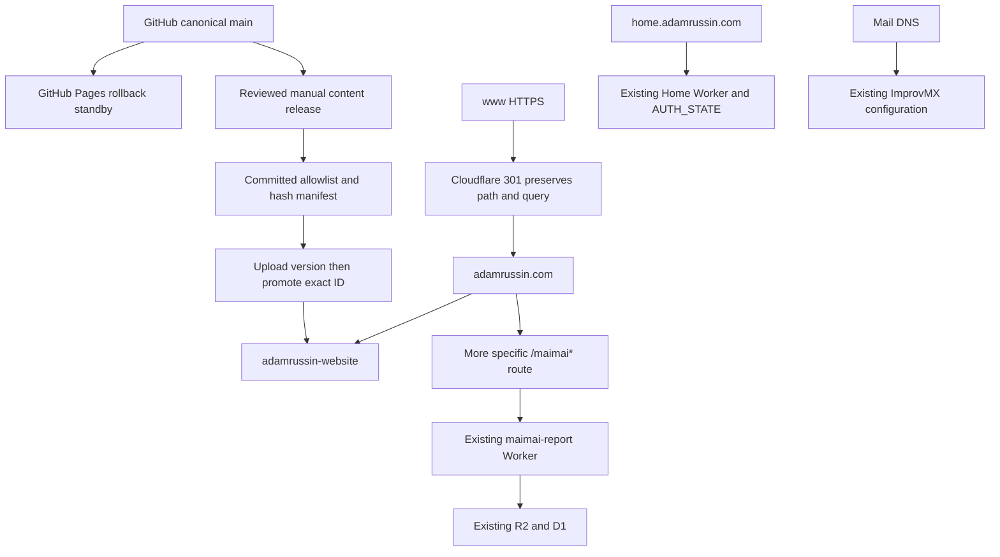
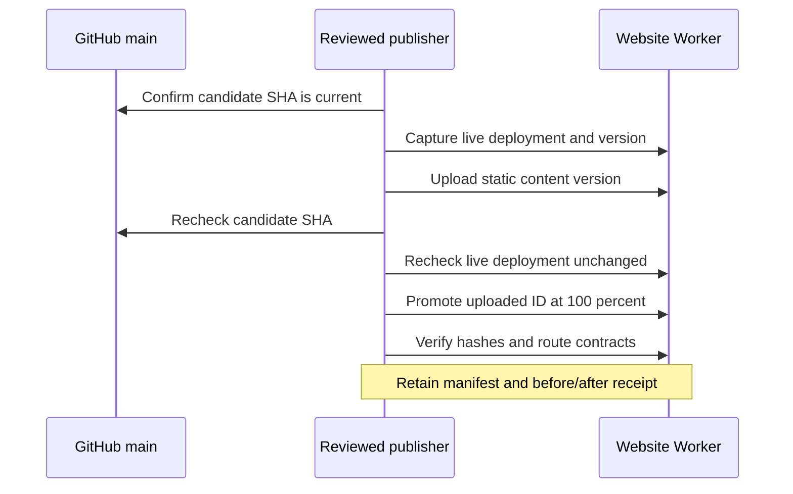

# Website hosting and publishing

## Verified hosting state — October 1, 2026 (EDT)

The public website now runs on Cloudflare Worker **adamrussin-website** at
**adamrussin.com**. The original upload was reused, without redeployment:

- Source: arussin/personal-website, commit cc6f0cfc908b1279a4ba261b506d3ae915e03c9c.
- Version: 03bf16a8-4d4a-4623-a09a-b04491562b5f, 100% traffic.
- Package: 79 files, 20,897,073 bytes; manifest SHA256
  407f87fc037e93c12df4c93901a5ed699510a251b3ca5863bac52fb0d81bad25.
- Production workers.dev and preview URLs disabled; no runtime bindings.
- www is proxied A 192.0.2.1. The last Single Redirect, after Goshen, matches
  (http.host eq "www.adamrussin.com" and ssl), returns 301 to
  concat("https://adamrussin.com", http.request.uri.path), preserving query strings.
- Existing Always Use HTTPS handles HTTP before the HTTPS canonical redirect.
- /events.html redirects 307 to /events, preserving its query and content.

All 79 live asset hashes, 21 static routing cases and 10 additional checks passed.
The existing 12 integration checks passed unchanged. Mail DNS, FTP, maimai routing,
its R2/D1 and Access policies, home and traffic services remain unchanged. These
checks do not claim physical home commands, a personal-data sync or email delivery.

## Publishing status

**Automatic Cloudflare publishing is NOT configured.** GitHub is canonical, but
main pushes currently rebuild GitHub Pages only. Pages remains enabled at main/root
with the source CNAME and custom-domain association as rollback standby. Its content
will advance with future pushes; retain the exact fallback commit above.

No new GitHub App connection, token, secret or persistent access was created.
The disabled workflow under deploy/ is a review template, not an active workflow.
Enabling automatic publication requires a separate decision on native Workers
Builds versus GitHub Actions, exact displayed permissions, and one evidenced test
publication. Do not reuse owner OAuth material or credentials from maimai.

## Manual content publication

Use the existing normal-owner Wrangler login and installed Wrangler 4.144.0.
Do not log in again, read/export tokens or restore old auth files. Publication
requires a separately requested content release; preparing scripts is not a release.

1. Edit canonical source and use DEVELOPMENT.md for the existing generator and
   browser checks in a disposable DevCache workspace. Commit generated pages with
   their sources. Preserve unrelated local changes. Merge the reviewed content into
   GitHub main before release. Review additions to deploy/public-allowlist.json.
2. From the canonical checkout, run node tools/package-worker.mjs ABSOLUTE_BUILD_DIR.
   On Windows choose a fresh C:/DevCache/projects/adamrussin-public-seo/releases/
   child. Packaging uses committed Git blobs and refuses existing output. It never
   includes CNAME, documentation, credentials, workflows or unrelated services.
3. Review the manifest, current website version and existing hostname settings.
   Run node tools/publish-worker.mjs ABSOLUTE_BUILD_DIR ABSOLUTE_WRANGLER_JS
   EXPECTED_LIVE_VERSION EXPECTED_SOURCE_SHA --execute only for the authorized release.
4. The script checks clean tracked source, GitHub main, package hashes, the expected
   live version and preserved service contracts. It writes a static-only config in
   the external build folder, uploads a version with --strict, records its exact ID,
   checks source and live deployment again, then promotes that ID at 100%.
5. Keep publication-receipt.json and the manifest. Acceptance requires verified
   public bytes and integration/redirect checks. Inspect hostname and alternate URL
   settings separately after the first publication. A failed run is not accepted.

Coordinate manual publishers: the final read-before-promote check is not an atomic
server lock. The script detects intervening deployment before promotion but cannot
eliminate a race after that read. Never run it concurrently with another publisher.
It does not manage triggers, DNS, domains, redirect rules, mail, Access, R2 or D1.
The first real content upload with this new script remains unperformed. Offline
tests validate packaging and guards; they do not prove a new CI credential works.

For read-only acceptance: node tools/verify-worker.mjs ABSOLUTE_MANIFEST and
node tools/verify-website-integrations.cjs. The publisher also checks www, Goshen,
the events alias and private-file exclusion. Run the existing browser suites for
content or visual changes; this migration changes no public asset bytes.

## Architecture

## Rollback

Content rollback: inspect the receipt and live deployment first. Promote the
recorded prior version using versions deploy PRIOR_VERSION@100 --yes with the
reviewed content config, then verify the prior manifest and service contracts.
Do not overwrite another publisher's newer release. Resolve source with a reviewed
revert, never a repository reset. The script stops on failure and preserves its
receipt; it does not silently perform a second production deployment.

Hosting rollback is separate and was authorized for this cutover: restore www to
CNAME arussin.github.io (Proxied, Auto) before removing Website www canonical redirect.
Remove only the website apex Custom Domain; restore exactly these apex A records,
all Proxied/Auto: 185.199.108.153, 185.199.109.153, 185.199.110.153, 185.199.111.153.
Verify Pages, maimai, home, traffic, Goshen and mail DNS. Never bulk-import the zone
export: it omits the managed home record. No Worker deletion, maimai redeploy,
home reset or change to permissions/security settings is necessary.

## References

- [Wrangler version and deployment commands](https://developers.cloudflare.com/workers/wrangler/commands/workers/)
- [Native GitHub Builds integration](https://developers.cloudflare.com/workers/ci-cd/builds/git-integration/github-integration/)
- [Worker authorization](https://developers.cloudflare.com/workers/authorization/workers/)

## GitHub Actions commissioning

The owner approved a dedicated account token with Individual Workers Editor
restricted to adamrussin-website. GitHub environment website-production permits
only the main branch and stores CLOUDFLARE_WEBSITE_API_TOKEN. No DNS, route,
other Worker, R2, D1, or account-wide permission is required.

The active workflow initially supports manual dispatch only, with the current
live version UUID required. It pins actions and runtimes, packages committed
bytes, promotes one exact version, and retains the manifest and receipt for 30
days. No credentials or raw CLI logs are retained as artifacts. Automatic push
publication is pending a successful controlled run. The old disabled template is
historical; .github/workflows/publish-website.yml is the executable workflow.
